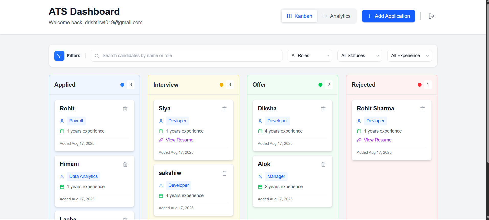

# Job Application Tracker + Analytics Dashboard (Mini ATS)

A **Next.js-based Applicant Tracking System (ATS)** that enables recruiters to visually track job applications and gain insights with a dynamic analytics dashboard.  
The system integrates **Supabase (PostgreSQL)** for database management and supports drag-and-drop Kanban boards, analytics charts, and authentication.


---

## Project Overview & Architecture

This project is designed as a **Mini ATS (Applicant Tracking System)** with two core modules:  

### 1. Job Application Tracker (Kanban Board)  
- Track job applications across stages: **Applied → Interview → Offer → Rejected**  
- Drag-and-drop functionality to move applications between stages  
- Add new applications via form (candidate name, role, experience, resume link)  
- Filter/search candidates by role, status, or experience  
- All data is stored and managed in **Supabase (PostgreSQL)**  

### 2. Analytics Dashboard  
- Visualizes the hiring pipeline using charts  
- Features include:  
  - Number of candidates in each stage (bar/pie chart)  
  - Candidate distribution by role (bar chart)  
  - Average candidate experience (stat card)  
- Dashboard updates dynamically when data in the database changes  


## Architecture Flow

Frontend (**Next.js + TailwindCSS**)  
⭣  
Backend (**Supabase Auth + API**)  
⭣  
Database (**PostgreSQL**)  
⭣  
Realtime Updates  
⭣  
Kanban Board & Analytics Dashboard


---

## Database Schema

This project uses **Supabase (PostgreSQL)** as the database.  
Below is the schema for the core table used in this project.

### Table: `candidates`

| Column       | Type        | Constraints                  | Description                                             |
|--------------|-------------|------------------------------|---------------------------------------------------------|
| id           | UUID        | Primary Key, Default: uuid() | Unique identifier for each candidate                    |
| name         | TEXT        | Not Null                     | Candidate's full name                                   |
| role         | TEXT        | Not Null                     | Job role applied for                                    |
| experience   | INTEGER     | Not Null, Default: 0         | Years of experience                                     |
| resume_link  | TEXT        | Nullable                     | URL to uploaded resume                                  |
| status       | TEXT        | Default: 'Applied'           | Application stage (Applied, Interview, Offer, Rejected) |
| created_at   | TIMESTAMP   | Default: now()               | Record creation timestamp                               |
| updated_at   | TIMESTAMP   | Default: now()               | Record update timestamp                                 |

Authentication and authorization are managed using **Supabase Auth Helpers**.


---

## Tech Stack

- **Framework**: Next.js 15 (App Router)  
- **Database & Auth**: Supabase (PostgreSQL)  
- **Styling**: TailwindCSS  
- **Charts**: Recharts  
- **Icons**: Lucide React  
- **Drag & Drop**: dnd-kit  


---

## Libraries Used

- `@dnd-kit/core` – drag-and-drop functionality  
- `@dnd-kit/sortable` – sortable Kanban columns  
- `@dnd-kit/utilities` – utility functions for drag-and-drop  
- `@supabase/supabase-js` – database client  
- `@supabase/auth-helpers-nextjs` – authentication integration  
- `date-fns` – date handling  
- `lucide-react` – icons  
- `recharts` – analytics dashboard charts  


---

## Setup & Deployment

### Local Setup
1. Clone the repository:
   ```bash
   git clone https://github.com/yourusername/job-ats-tracker.git
   cd job-ats-tracker

2. Install dependencies:
npm install

3. Configure environment variables in .env.local:
NEXT_PUBLIC_SUPABASE_URL=your-supabase-url
NEXT_PUBLIC_SUPABASE_ANON_KEY=your-supabase-anon-key

4. Run the development server:
npm run dev

5. Open the application in your browser:
http://localhost:3000


### Deployment

- Hosted on Vercel: ats-tracker-seven.vercel.app
- Backend powered by Supabase Cloud (PostgreSQL + Auth)


---

## Demo Video

[](https://drive.google.com/file/d/1Z9nmKukVjFSvP6l2md4KCYwYi421EjPr/view?usp=sharing)


---

## Author

- Developed by Drishti Rawat